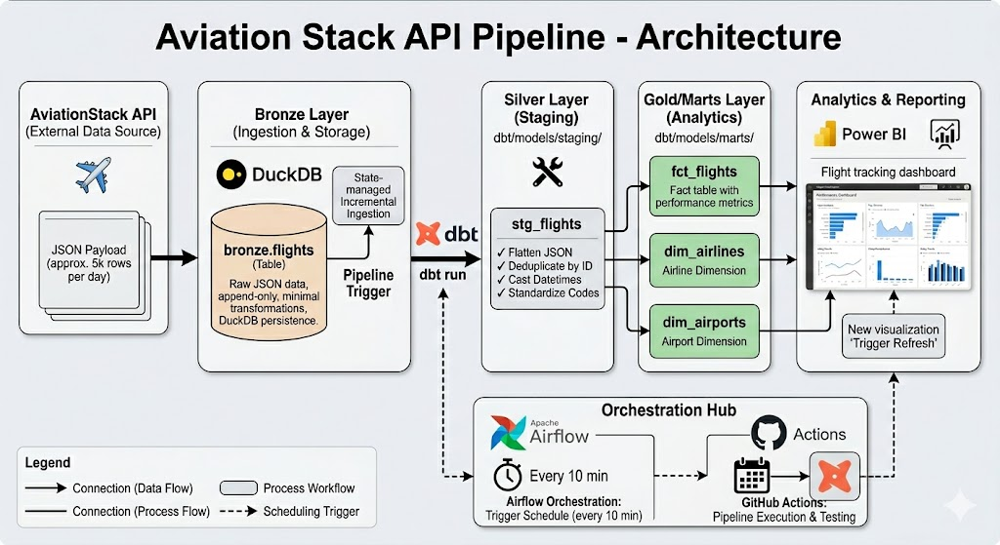

# AviationStack Data Pipeline

A scalable data pipeline that ingests real-time flight data from AviationStack API, stores it in DuckDB, and transforms it using dbt for analysis and reporting. This foundation supports global aviation data analytics with the flexibility to drill down into specific countries or regions for deeper analysis.

## Architecture

```
AviationStack API → DuckDB (Bronze) → dbt (Silver/Marts) → Analytics-Ready Data
```

The pipeline follows a medallion architecture:
- **Bronze**: Raw flight data ingested from the API and stored in DuckDB
- **Silver**: Cleaned, deduplicated, and standardized data (via dbt)
- **Marts**: Analytical fact and dimension tables ready for reporting (via dbt)


## Architecture Diagram



## Quick Start

### Prerequisites
- Python 3.12+
- AviationStack API key
- IDE

### Setup

1. **Clone and navigate to the repository**
   ```bash
   cd aviationstack-pipeline
   ```

2. **Create and activate virtual environment**
   ```bash
   python -m venv .venv
   source .venv/bin/activate  # On Windows: .venv\Scripts\Activate.ps1
   ```

3. **Install dependencies**
   ```bash
   pip install -r requirements.txt
   ```

4. **Configure environment**
   ```bash
   cp env.example .env
   # Edit .env with your AviationStack API key
   ```

### Run the Pipeline

Execute the full pipeline (ingest → transform → validate):
```bash
python -m src.pipelines.run_pipeline
```

The pipeline will:
1. Fetch flight data from AviationStack API
2. Ingest into DuckDB bronze layer
3. Run dbt transformations (staging + marts)
4. Execute dbt tests for data validation
5. Update pipeline state

## Project Structure

```
.
├── src/
│   ├── ingestion/          # API client for fetching flight data
│   ├── pipelines/          # Pipeline orchestration
│   ├── storage/            # DuckDB handler and schema
│   └── utils/              # Logging and state management
├── dbt/
│   ├── models/
│   │   ├── staging/        # Silver layer (cleaned data)
│   │   └── marts/          # Gold layer (facts & dimensions)
│   └── profiles.yml        # dbt DuckDB configuration
├── data/
│   ├── aviation.duckdb     # DuckDB database
│   └── state/              # Pipeline state tracking
├── .github/workflows/      # GitHub Actions scheduling
└── config/                 # Settings and configuration
```

## Tech Stack

- **Data Ingestion**: Python + requests + AviationStack API
- **Storage**: DuckDB (embedded SQL database)
- **Transformations**: dbt with DuckDB adapter
- **Orchestration**: Python scheduler (GitHub Actions for cloud scheduling)
- **Logging**: Loguru

## Next Steps

- **Local Testing**: Run `python -m src.pipelines.run_pipeline` to verify the pipeline works
- **Regional Analysis**: With a higher API plan, I could filter data by country or region. For example, focus on Portuguese airports to analyze national aviation traffic patterns, correlate operational variables, and identify trends in aviation activity
- **Cloud Scheduling**: Deploy to Airflow for reliable, scalable orchestration
- **Visualization**: Query the marts tables for dashboards and reporting
- **Monitoring**: Track pipeline runs in `logs/` directory

## Configuration

Edit `config/settings.py` to customize:
- API limits and timeouts
- DuckDB database path
- Logging levels
- State tracking location

## License

See [LICENSE](LICENSE) for details.
